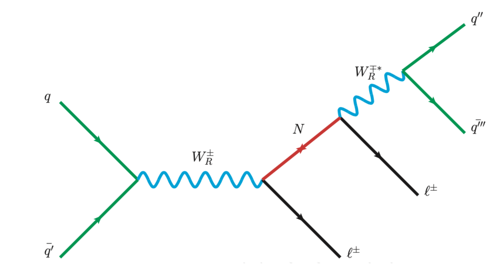
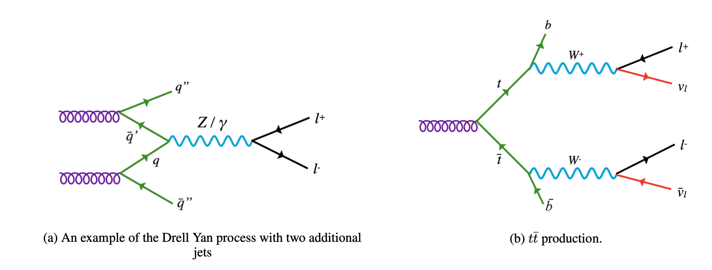
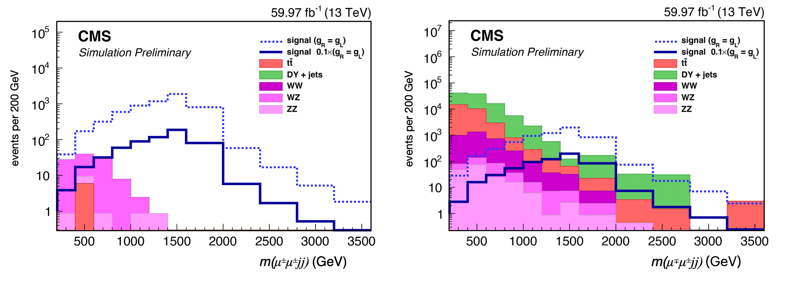
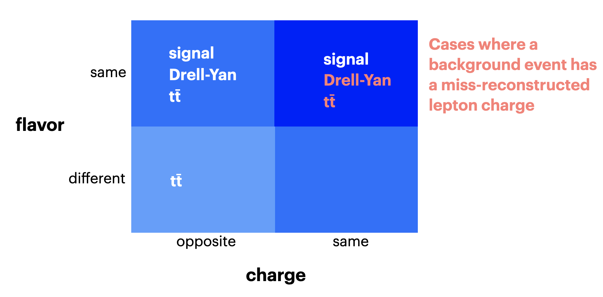
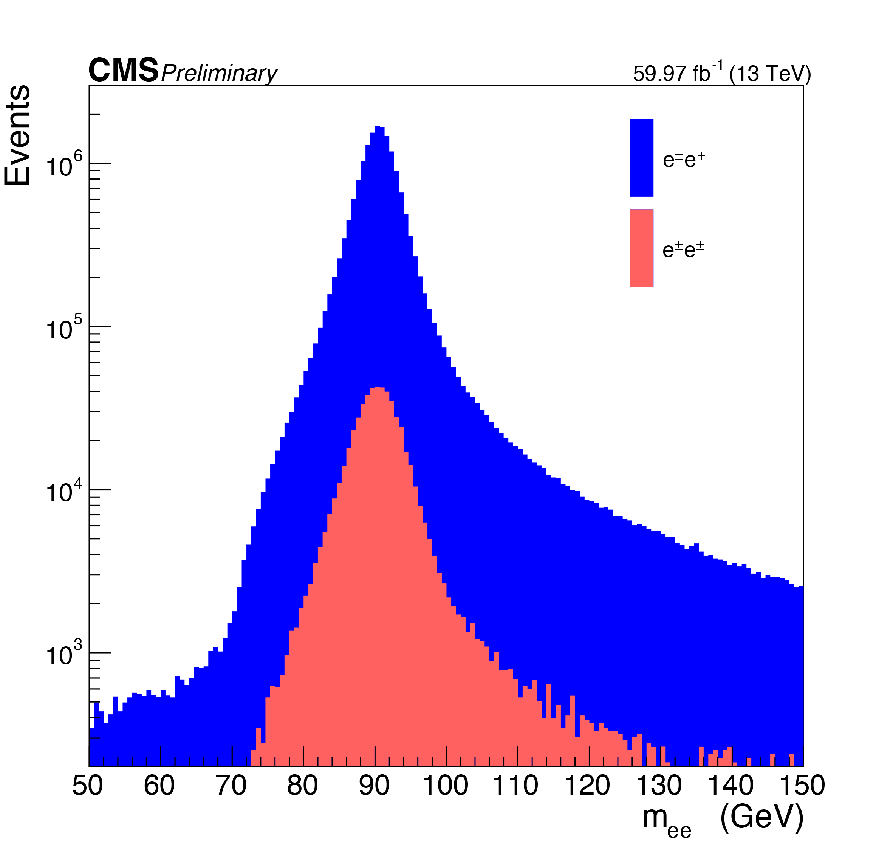
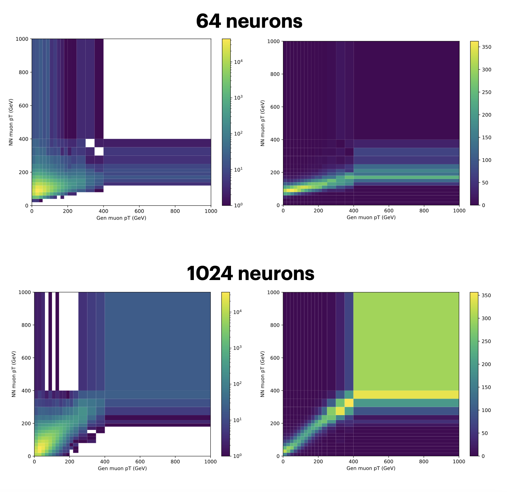
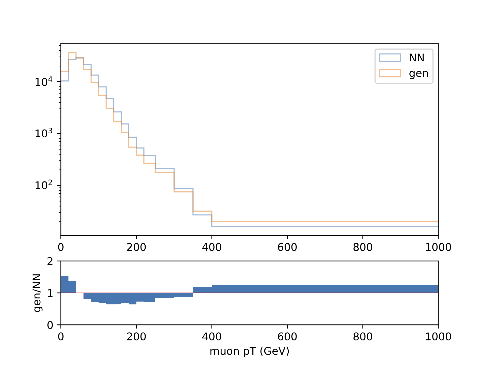
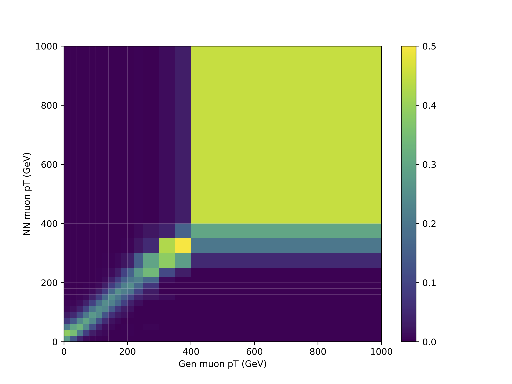

# Rationale and performance

## Physics Background

### Signal

The signal model for this *Wr* search assumes a final *lljj* state. A *Wr* is produced and decays into a *Nr*, which produces two quarks mediated by a virtual *Wr*. The quarks hadronize into two jets and the leptons at the *Nr* vertices are constrained to be the same flavor. Given the assumed majorana nature of the *Nr*, it will rapidly oscillate and between neutrino and anti-neutrino states and consequently the lepton charge at the second *Nr* vertex would be uncorrelated with the charge of the other lepton.

### Backgrounds

The two primary backgrounds in this analysis are Drell-Yan (DY) process with additional jets and *tt̅* production. The DY process results in oppositely charged same flavor leptons mediated by a virtual photon or *Z* boson created by the annihilation of a quark and anti-quark. Additional quarks from the collision may hadronize in the detector and create jets. The other primary background, *tt̅* production, starts with a top (*t*) and anti-top (*t̅*) quark being produced which decay to neutrinos and oppositely charged leptons each through an intermediate *W* boson. There is no constraint on the flavor of the leptons in the case of *tt̅* production, and a bottom and anti-bottom quark from the decay of each top hadronize to create additional jets.

Constraining the charge of the leptons to each having the same sign would reduce the signal yield but eliminate nearly all DY and *tt̅* background. The signal and background estimation for the same sign and opposite sign lepton cases are shown below.

A source of irreducible background after the same sign lepton charge requirements are imposed would be *tt̅* and DY events where a lepton has misreconstructed charge.

In order to estimate this irreducible background, rates of electron and muon charge miss-identification must be measured. To accurately implement these rates in the *lljj* invariant mass plots, these rates must be found as a function of the transverse momentum of the lepton. This measurement can and has been performed for electrons using DY samples where the mass peak of two electrons at the Z boson mass allows for accurate identification of true *Z→e,e* events, shown below.

The Z mass peak is smeared out for same sign *Z→μ,μ* events due to the less accurately reconstructed muon transverse momentum in the cases of misreconstructed charge. This project aims to use new strategies to estimate the muon charge misidentification rate with the goal of being more accurate in the determination of muon transverse momentum for charge flipped events.

## Neural Network approach

The strategy for estimating the rate of muon charge misidentification as a function of *pT* involves the analysis of *tt̅* events rather than DY events. The *tt̅* process can be effectively selected in data utilizing the fact that the top quarks decay to b quark jets which are identifiable from kinematic observables related to the *b* decay process via *b*-tagging. For the measurement, we then use events where the *tt̅* decay to an electron, a muon, two *b*-jets, and two neutrinos. The muon *pT* distributions for same sign lepton charge *tt̅* events can be compared to the total muon *pT* distribution to extract the muon charge misidentification rate as a function of muon *pT*. 

We assume that, due to the nature of the muon detection system and track reconstruction process, muons with the incorrectly reconstructed charge will also be prone to inaccurate *pT* reconstruction. This requires the development of an alternate method of determining muon *pT*. Various methods of regression using kinematic variables of the jets and outgoing particles of the *tt̅* decay were explored, and a dense neural network (DNN) acheived the best results. Benchmarks include a model that is linear in electron *pT* and a multivariate linear regression of kinematic variables relaated to the final state particles.

|       | mean absolute error (muon pT GeV) |
| ----------- | ----------- |
| DNN      | 14.83       |
| electron pT   | 92.10        |
| multivariate linear | 64.45        |

  
  
There are many possible configuration of DNN hyperparameters which include the number of dense or dropout layers, dropout rate, optimizer, activation function, and network width (number of neurons per layer). The large hyper parameter space was explored using a genetic algorithm to generate random configurations and set them to "compete" against each other. A default configuration of 1024 neurons, 2 dense layers, two dropout layers, the ADAM optimizer, and ReLu activation function were chosen based on the performance of this configuration in the aforementioned genetic algorithm run. The migration plots shown below (unormalized on the left and normalized on the right) demonstrate how varying one of these hyperparameters, the network width, can affect the overall performance. This procedure can be performed again for different sets of physics parameters as training inputs to the networks. 

The latest migration plot and 1D distribution representing the network's ability to predict the muon pT are shown below.

